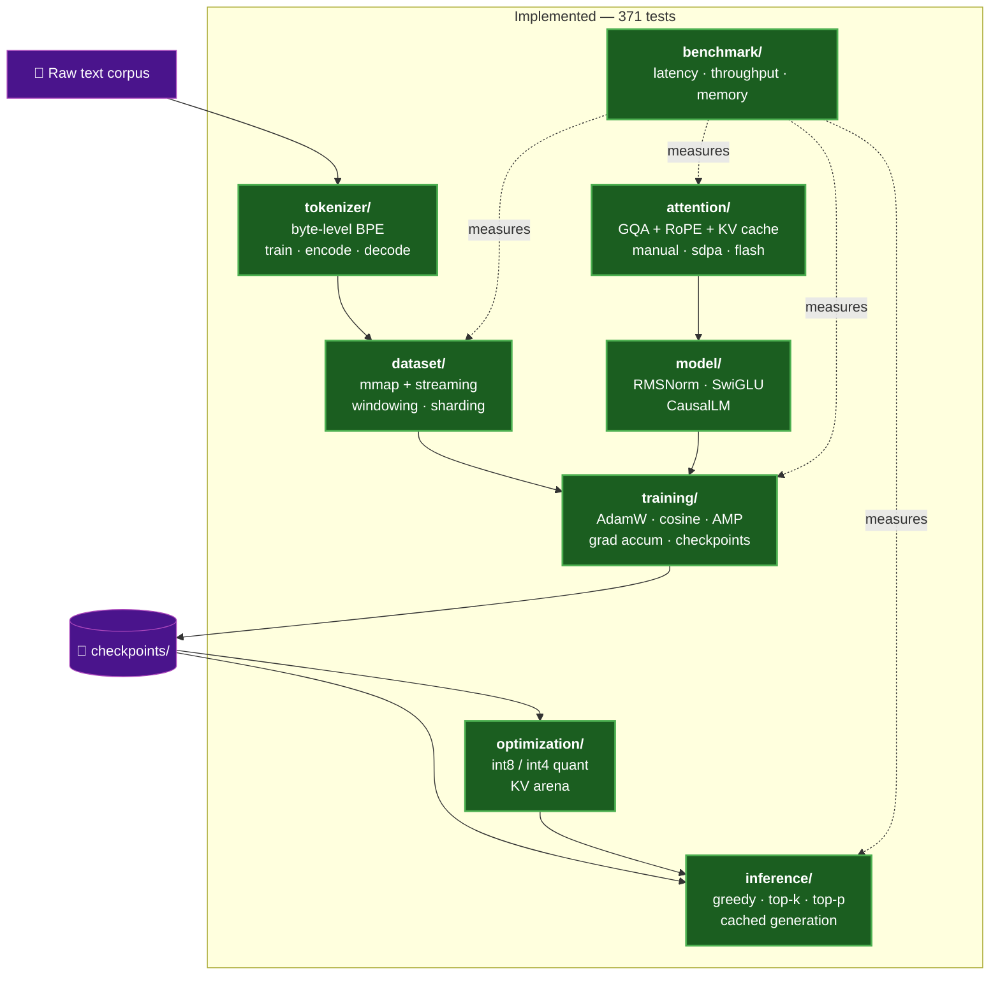
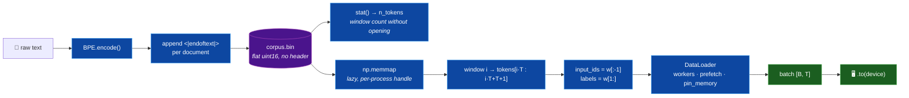
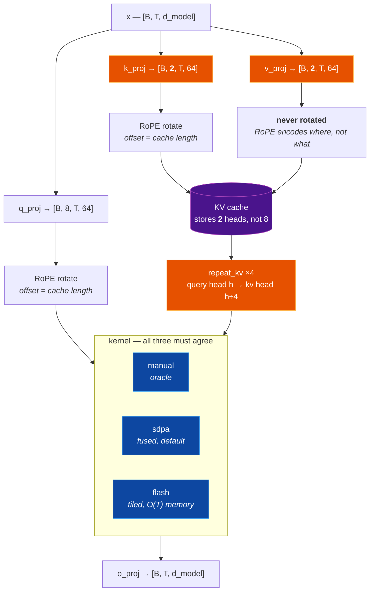
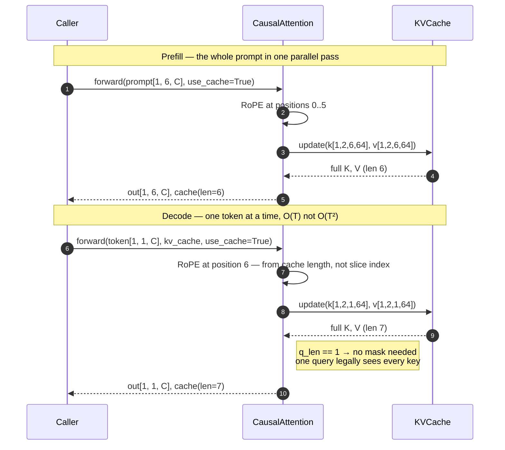
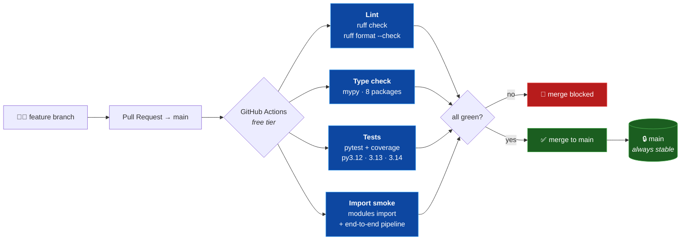
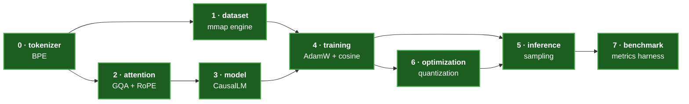

<div align='center'>
<h1 align='center'> Language Model Engine 🧠⚡ </h1>
<p align='center'> A decoder-only GPT-style language model built entirely from scratch in PyTorch — custom byte-level BPE tokenizer, memory-mapped data engine, grouped-query attention with RoPE, a hand-written tiled attention kernel, a hand-written AdamW, and cached autoregressive generation. No pretrained weights, no HuggingFace. </p>
<div>


</div>
</div>

---

### Project Overview

*This project builds a complete language model system from first principles, with the emphasis on low-level systems engineering rather than on training a model quickly.*

- **Everything is hand-written:** BPE merges, rotary embeddings, grouped-query attention, the KV cache, a tiled online-softmax attention kernel *with its own recomputing backward*, and AdamW are all implemented directly — the only thing borrowed from PyTorch is tensor math.
- **Three interchangeable attention kernels:** a readable `manual` reference, torch's fused `sdpa`, and our own `flash` tiled implementation. All three are asserted to produce identical output, so the reference acts as a correctness oracle for the optimised paths.
- **Memory-mapped data engine:** the corpus is a bare `uint16` array on disk read through `mmap`, so window count comes from `stat()` alone and no bulk copy ever enters RAM — even with multiprocessing workers.
- **GQA that actually saves memory:** 8 query heads share 2 KV heads, shrinking the KV cache **4×** (2048 KiB → 512 KiB per layer at 512 tokens) and the attention parameters by 37.5%.
- **Test-driven throughout:** every module's exit test is written before its implementation. **371 tests** currently pass across unit and integration suites.
- **Runs on Apple Silicon:** device resolution is `mps → cuda → cpu`, with bf16 autocast on MPS and no `GradScaler` (which is CUDA-only).

---

### System Architecture



| Module | Responsibility | State |
|---|---|---|
| `tokenizer/` | Byte-level BPE, GPT-2 pre-tokenization, piece cache, incremental training index | ✅ 54 tests |
| `dataset/` | `uint16` corpus format, mmap/streaming readers, corpus download, document split, message prep | ✅ 76 tests |
| `attention/` | RoPE, grouped-query causal attention, KV cache, three kernels + recomputing backward | ✅ 43 tests |
| `model/` | RMSNorm, SwiGLU, pre-norm blocks, `CausalLM` with weight tying and depth-scaled init | ✅ 25 tests |
| `training/` | Hand-written AdamW, cosine schedule, AMP, grad accumulation, checkpoints, validation | ✅ 58 tests |
| `inference/` | Greedy / top-k / top-p sampling, cached generation, batched generation with key padding | ✅ 29 tests |
| `optimization/` | int8 / int4 per-channel weight quantization, preallocated KV arena | ✅ 38 tests |
| `benchmark/` | Device-synced timing harness, p50/p90/p95/p99, exact memory metrics, baseline report | ✅ 25 tests |

---

### Data Pipeline



Each window reads **`T + 1`** ids and splits them, rather than reading `T` and shifting inside the window. That one extra token means the final position gets a *real* label instead of padding — shifting inside would silently discard 1/512 of the training signal and teach one position from a fake target.

---

### Attention Architecture



#### KV cache: prefill then decode



The RoPE offset in step 7 is the single easiest bug to ship in this module: rotating a decode token at position 0 instead of `cache_len` leaves prefill looking perfect while every generated token believes it is the start of the sequence. `test_cached_decode_matches_full_forward` pins it by asserting that token-by-token decoding reproduces one full parallel forward exactly.

#### Tiled ("flash") attention


The full `T × T` score matrix is never allocated — peak memory is O(T) rather than O(T²). This is asserted rather than claimed: `test_flash_never_materialises_the_full_score_matrix` monkey-patches `torch.matmul` and fails if any intermediate exceeds the tile width.

---

### Training on Real Data

```bash
python -m dataset.prepare_corpus --corpus tinyshakespeare --vocab-size 8192
python -m training.train --config configs/tinyshakespeare.yaml
```

`prepare_corpus` downloads, fits a vocabulary on a bounded sample, splits **by
document**, and writes `train.bin` / `val.bin` beside the `vocab.json` they were
encoded with. Training then reports held-out perplexity every `eval_every` steps.

Two properties worth knowing:

- **The split is by document, never by token.** Windows are contiguous slices of
  one flat array, so cutting a *tokenised* stream puts validation tokens inside
  training windows and the reported perplexity comes out quietly too good.
  Documents are assigned by a hash of their own text, so the split is
  reproducible without storing a seed, and adding documents never reshuffles
  existing ones across the boundary.
- **Corpora are never committed.** `data/` is gitignored, and every entry records
  its licence, because "where did the training data come from" is unpleasant to
  answer retroactively.

Behind a TLS-inspecting corporate proxy (Zscaler and similar), `requests` fails
where `curl` succeeds — the proxy re-signs certificates with a corporate root CA
that certifi does not carry. `pip install -e ".[data]"` pulls in `truststore`,
which routes verification through the OS keychain. Verification is never
disabled.

#### Email and chat corpora

`dataset/messages.py` prepares mail and message records — stripping quoted
replies, signatures and confidentiality footers, optionally adding
`<|from|>` / `<|subject|>` / `<|body|>` structure tokens, and masking recognisable
identifier shapes. It ships **no connector to any mailbox or workspace**;
the caller supplies the records.

Read the module docstring before pointing it at real mail. Three things are true
and none of them are obvious:

1. **A model memorises its training data.** This project measured a 32.5M-param
   model reaching loss 0.017 on a 10,677-token corpus — reproducing it. A
   checkpoint trained on mail *is* a copy of that mail and inherits its handling
   obligations.
2. **`redact()` is best-effort, not a compliance control.** It catches shapes
   (addresses, phone numbers, long digit runs). It cannot catch a name in prose
   or a deal codename — `test_redaction_cannot_catch_a_name_in_prose` pins that
   limit deliberately.
3. **A mailbox is a fine-tuning corpus, not a pretraining one.** ~1–10M tokens
   against the ~650M this model size wants; trained alone it memorises.

---

### Optimization Strategy

| Concept | Implementation | Measured effect |
|---|---|---|
| **Grouped-Query Attention** | 8 query heads share 2 KV heads; the cache stores the *unexpanded* heads and `repeat_kv` expands only on read | KV cache **2048 KiB → 512 KiB** per layer at 512 tokens; attention params 1,048,576 → 655,360 |
| **KV cache** | Prefill computes all K/V once, then each decode step appends a single position | Generation drops from O(T²) recomputation to O(T) |
| **Tiled attention** | Block-wise online softmax with running max and denominator; fully-masked tiles are skipped entirely | Score memory O(T²) → O(block_q × block_k) |
| **Memory-mapped corpus** | Bare `uint16` array; `np.memmap` opened lazily *per process* and dropped on pickle | No bulk copy into RAM; each DataLoader worker gets its own handle instead of the corpus through a pipe |
| **RoPE as buffers** | cos/sin tables registered with `persistent=False` | Derived constants stay out of every checkpoint |
| **Header-free token format** | File is exactly `n_tokens × 2` bytes | Window count from `stat()` — no open, no parse, no read |
| **Per-channel weight quantization** | Symmetric int8/int4 with one scale per output row; int4 packs two codes per byte | 128.03 MiB → 41.21 MiB (int8) / 26.71 MiB (int4), perplexity within 10% |
| **Preallocated KV arena** | One `[B, H, max_seq_len, D]` allocation written in place, replacing per-step concatenation | Zero allocations per decode step; reserved-vs-used bytes reported separately |

---

### Pipeline Workflow

**(1)** Tokenization:
- Text is encoded to UTF-8 bytes, so there are no unknown tokens for any input — emoji and rare scripts included.
- BPE merges are learned greedily, with deterministic tie-breaking so training is reproducible.
- Special tokens occupy the lowest ids and are atomic — never merged across.

**(2)** Corpus packing:
- Documents are encoded and joined with `<|endoftext|>` so windows cannot silently splice one document onto the next.
- Ids are validated against the `uint16` range and written as a flat array. An out-of-range id raises rather than wrapping (`65536 → 0`), which would corrupt the corpus in a way that only surfaces much later as inexplicable loss.

**(3)** Windowing:
- `stat()` gives the token count; `(n_tokens − 1) // seq_len` gives the window count.
- Each window reads `seq_len + 1` ids and splits into `input_ids` / `labels`.
- Workers shard strided (`order[worker_id::num_workers]`) so no window is emitted twice.

**(4)** Attention:
- Q/K/V are projected, split into heads, and Q/K rotated by RoPE at their absolute positions.
- KV heads are cached pre-expansion, then expanded to full head count on read.
- The kernel masks according to the `q_len` / `k_len` relationship — full triangle, no mask, or an explicit bottom-right triangle for chunked prefill.

---

### Setting up the project in your machine

#### Prerequisites

- Python 3.12+
- pip
- Git

#### Clone the repository

```bash
git clone https://github.com/555aaditya/Language-Model.git
cd Language-Model
```

#### Install dependencies

```bash
python3 -m venv .venv
source .venv/bin/activate
pip install -e ".[dev]"
```

#### Verify the install

```bash
pytest
```

*Expected output:*
```
370 passed, 1 skipped
```

#### Run the entry point

```bash
python -m training.train --config configs/default.yaml
```

*Expected output (on Apple Silicon):*
```
device: mps | amp dtype: torch.bfloat16
dataset engine OK: input_ids (16, 512), labels (16, 512) on mps:0
```

Any config key can be overridden from the command line with dotted notation:

```bash
python -m training.train --config configs/default.yaml training.lr=3e-4 model.n_layers=12 attention.impl=flash
```

---

### Testing

```bash
pytest                                    # everything (371 tests)
pytest tests/unit -q                      # unit only
pytest tests/integration -q               # cross-module seams
pytest tests/unit/test_attention.py -q    # one module
```

Reproduce the CI gate locally:

```bash
ruff check .
ruff format --check .
mypy tokenizer dataset model attention training inference optimization benchmark
pytest --cov=tokenizer --cov=dataset --cov=attention --cov-report=term-missing
```

| Suite | Tests | What it pins |
|---|---|---|
| `test_tokenizer.py` | 14 | Encode/decode round trips, unicode, merge ordering, special tokens, serialisation |
| `test_dataset.py` | 29 | `uint16` bounds, window arithmetic, next-token shift, worker sharding, DataLoader trap avoidance |
| `test_attention.py` | 39 | Causal masking, RoPE relative-distance property, GQA group mapping, KV-cache equivalence, kernel agreement |
| `test_model.py` | 25 | RMSNorm vs LayerNorm behaviour, SwiGLU gating, pre-norm residuals, parameter count, weight tying, cached decode |
| `test_optimizer.py` | 20 | AdamW matching `torch.optim.AdamW` step for step, decoupled decay, no-decay groups, cosine schedule shape |
| `test_trainer.py` | 18 | Overfit-one-batch, grad accumulation equivalence, clipping, LR schedule, checkpoint resume |
| `test_train_config.py` | 20 | YAML loading, dotted-key overrides, type preservation across overrides |
| `test_inference.py` | 29 | Greedy determinism, top-k/top-p set selection, cross-device seeded sampling, cached-vs-uncached generation |
| `test_tokenizer_dataset_attention.py` | 5 | Cross-module seams: tokenizer → `.bin` → batches → attention |
| `test_quantization.py` | 21 | int8/int4 round-trip error bounds, per-channel scales, real byte savings, perplexity tolerance |
| `test_kv_pool.py` | 17 | Arena never reallocates, returns only the filled prefix, generates identically to the concat cache |
| `test_benchmark.py` | 25 | Device sync, interpolated percentiles, undersampling detection, exact memory arithmetic, baseline reproduction |
| `test_pretokenize.py` | 40 | Pattern tiles every input, no cross-piece merges, cache soundness, sub-quadratic scaling |
| `test_messages.py` | 22 | Quoted-reply/signature/disclaimer stripping, redaction limits, structure tokens |
| `test_corpora_and_eval.py` | 25 | Document-split disjointness and stability, validation perplexity, batched generation |
| `test_end_to_end.py` | 5 | Full pipeline learns real text; trained model's cache stays equivalent; resume converges |

---

### A Measured Run

Training this repo's own `docs/TDD.md` as a corpus, on an M5 Pro via MPS:

| | |
|---|---|
| Corpus | 39,922 chars → **10,677 tokens** (3.74 chars/token) |
| Tokenizer | 2,048 vocab, 1,791 merges, trained in 4.0 s |
| Model | 4.33M params — `d_model` 256, 4 layers, 8 heads / 2 KV heads |
| Throughput | **~75,000 tokens/sec** (bf16 autocast) |
| 250 steps | 6.9 s wall clock |
| Loss | 7.679 → 0.017 (baseline `ln(2048)` = 7.625) |

**Read that loss honestly:** 4.33M parameters against 10,677 tokens is a ~400:1
overparameterisation, so 0.017 is memorisation, not language modelling. The
generations show it — correct markdown structure, real vocabulary from the
document, no coherent syntax. What the run demonstrates is that the *pipeline*
is sound end to end: the tokenizer round-trips, the corpus packs, gradients
flow, the schedule fires, and the cache generates. Producing a model worth
evaluating needs a corpus several orders of magnitude larger, which is what the
`benchmark/` stage exists to measure.

---

### Benchmark Results

`python -m benchmark.report --config configs/default.yaml`

The report deliberately splits into two halves, because they deserve different
levels of trust. **Deterministic** metrics are exact arithmetic over tensor
shapes — identical on every machine, and asserted against a checked-in baseline
in CI. **Measured** metrics are wall-clock and reproducible only in shape.

#### Deterministic — 32.51M parameters, `configs/default.yaml`

| Precision | Size | Compression |
|---|---|---|
| fp32 | 128.03 MiB | 1.00× |
| fp16 | 64.02 MiB | 2.00× |
| int8 | 41.21 MiB | **3.11×** |
| int4 | 26.71 MiB | **4.79×** |

int8 lands at 3.11×, not the 4× the bit-width suggests — because the token
embedding is tied to the LM head and is deliberately **not** quantised (see the
design table below). At 2.1M parameters it stays fp32 and sets a floor on how
small the model can get. Quoting 4× here would be arithmetic that the code
doesn't do.

| KV cache @ 1024 tokens | Size |
|---|---|
| MHA (8 KV heads) | 32.0 MiB |
| GQA (2 KV heads) | **8.0 MiB** — 4.00× smaller |

#### Measured — Apple M5 Pro, MPS, torch 2.13, bf16

| Phase | runs | p50 | p90 | p95 | p99 | max | stdev |
|---|---|---|---|---|---|---|---|
| Prefill (32 tok) | 100 | 2.80 ms | 2.88 ms | 2.93 ms | 2.99 ms | 3.00 ms | 0.05 ms |
| Decode (32 tok) | 20 | 77.86 ms | 78.21 ms | 78.39 ms | 78.73 ms | 78.81 ms | 0.35 ms |

Throughput: **8,026 tok/s** prefill, **411 tok/s** decode (2.43 ms/token),
**~75,000 tok/s** training.

Sample counts are set per phase rather than globally, because a percentile is
only as good as the samples behind it: with `n` runs the finest resolvable tail
probability is `1/n`, so a p99 from 10 runs is just the maximum wearing a
different label. Every timing therefore carries `resolvable_percentile`
alongside it — p99.0 for prefill, p95.0 for the slower decode loop.

KV cache speedup, measured rather than assumed (TDR-012):

| New tokens | Cached | Uncached | Speedup |
|---|---|---|---|
| 16 | 40.6 ms | 51.8 ms | 1.27× |
| 64 | 154.3 ms | 208.1 ms | 1.35× |
| 256 | 620.2 ms | 1150.0 ms | **1.85×** |

The speedup grows with sequence length, which is the O(T²) → O(T) claim showing
up. It is also **modest in absolute terms** — at 32M parameters, per-step Python
dispatch and MPS kernel-launch overhead are a large share of each decode step, so
the asymptotic win is partly masked by constant factors. The benchmark reports
the ratio whichever way it falls, including the short-sequence regime where the
cache can genuinely lose.

---

### CI / Infrastructure



`main` is locked (TDR-013): all work happens on feature branches and merges only through a reviewed PR with every CI job green.

---

### Build Order



Each stage has an exit test written *before* the implementation. See [`docs/BUILD_ORDER.md`](docs/BUILD_ORDER.md) for the stable interface contracts.

---

### Tools and Technologies

| Tool / Technology | Purpose |
|---|---|
| **PyTorch 2.13** | Autograd, tensor math, and device management — every layer above that is hand-written |
| **NumPy** | `memmap` corpus reader and the `uint16` on-disk token format |
| **Apple MPS** | Primary development accelerator; bf16 autocast, fused `scaled_dot_product_attention` |
| **pytest** | 371-test TDD suite — exit tests written before each module |
| **ruff** | Linting and formatting, 100-char lines, `E/F/I/W/UP/B` rule set |
| **mypy** | Static type checking across all eight packages |
| **PyYAML** | Config format, reused as the CLI override parser so types can never diverge |
| **GitHub Actions** | Free-tier CI: lint, type check, tests on three Pythons, import smoke |

---

### Key Design Decisions

Full rationale and alternatives for each is recorded as a Technical Decision Record in [`docs/TDD.md` §13](docs/TDD.md).

| Decision | Rationale |
|---|---|
| **Byte-level BPE** (TDR-002) | Zero out-of-vocabulary tokens for arbitrary UTF-8. A GPT-2 style `bytes_to_unicode` table renders every byte to a printable character, so token keys never collide with special-token text. |
| **Rotary position embeddings** (TDR-015) | Attention scores become a function of *relative* offset, removing a `max_seq_len × d_model` parameter table entirely. Supersedes the learnable absolute table originally specified in TDR-006, which was never implemented. |
| **Grouped-query attention** (TDR-016) | The KV cache — not the weights — dominates decode memory, and it scales with `n_kv_heads`. A 4:1 group ratio cuts the cache 4× for negligible quality cost, which matters directly on unified memory. |
| **RMSNorm + SwiGLU** (TDR-017) | RMSNorm drops mean-centring and bias for one fewer reduction pass; SwiGLU's multiplicative gate beats a plain GELU MLP at equal parameter count. |
| **Loss lives in the trainer, not the model** | `CausalLM.forward` returns logits only. Computing a loss during inference is wasted work, and keeping the model pure makes the generation path obvious. |
| **Dict batches, not tuples** | Datasets yield `{"input_ids", "labels"}` so a field can be added later without breaking every caller — and so a transposed `(x, y)` can't silently typecheck. |
| **`uint16` token format** | Caps the vocabulary at 65,536, comfortably above GPT-2's 50,257. Out-of-range ids raise instead of widening the format and doubling the page-cache footprint. |
| **Three attention kernels, asserted equal** (TDR-007) | Optimised kernels are only trustworthy against a reference. `manual` is the oracle; `sdpa` and `flash` must match it within floating-point tolerance or the build fails. |
| **Python 3.12 floor** | numpy ≥ 2.3 ships PEP 695 syntax in its stubs that mypy rejects when targeting older versions. Rather than typecheck against a Python we never run, runtime, ruff, mypy and the CI matrix all share one floor. |
| **MPS as the primary target** (TDR-019) | It is the hardware this is actually built on, so it is the only device whose numbers can be reported honestly. Benchmarks are always reported per-device, never as a general claim. |
| **Locked `main`, PR-gated** (TDR-013) | Every state of the repository stays auditable and revertible; CI green is a merge requirement. |

---

### Repository Layout

```
Language-Model/
├── tokenizer/        # byte-level BPE          ✅
│   ├── bpe.py
│   └── pretokenize.py    # GPT-2 style splitter (TDR-020)
├── dataset/          # data engine             ✅
│   ├── binfile.py        # uint16 corpus format
│   ├── token_dataset.py  # mmap / streaming / synthetic readers
│   ├── engine.py         # DataEngine → endless device-ready batches
│   ├── corpora.py        # download + document-level train/val split
│   ├── messages.py       # email / chat cleaning and redaction
│   └── prepare_corpus.py # preparation CLI
├── attention/        # attention               ✅
│   ├── rope.py           # rotary position embeddings
│   ├── kv_cache.py       # per-layer K/V cache
│   ├── kernels.py        # manual · sdpa · flash
│   └── causal.py         # CausalAttention (GQA)
├── model/            # transformer             ✅
│   ├── norm.py           # RMSNorm
│   ├── ffn.py            # SwiGLU
│   ├── block.py          # pre-norm TransformerBlock
│   └── causal_lm.py      # CausalLM
├── training/         # training engine         ✅
│   ├── optimizer.py      # hand-written AdamW + param groups
│   ├── scheduler.py      # cosine decay w/ linear warmup
│   ├── trainer.py        # AMP, grad accum, clipping
│   ├── checkpoint.py     # save / resume
│   ├── device.py         # mps → cuda → cpu resolution
│   └── train.py          # config, overrides, CLI
├── inference/        # generation              ✅
│   ├── sampling.py       # temperature · top-k · top-p
│   ├── generate.py       # cached autoregressive loop
│   └── batched.py        # multi-request generation
├── optimization/     # post-training opt       ✅
│   ├── quantize.py       # int8 / int4 per-channel weights
│   └── kv_pool.py        # preallocated KV arena
├── benchmark/        # metrics harness         ✅
│   ├── harness.py        # device-synced timing + percentiles
│   ├── memory.py         # exact footprint arithmetic
│   ├── latency.py        # prefill / decode / cache speedup
│   ├── throughput.py     # training tokens per second
│   └── report.py         # JSON report CLI
├── configs/          # default.yaml
├── checkpoints/      # serialised state
├── docs/             # TDD.md · BUILD_ORDER.md
├── tests/            # unit/ + integration/
└── .github/          # CI workflows
```

---

### Documentation

| Document | Contents |
|---|---|
| [`docs/TDD.md`](docs/TDD.md) | Full technical design — architecture, algorithms, memory analysis, tradeoff matrices, and 19 Technical Decision Records |
| [`docs/BUILD_ORDER.md`](docs/BUILD_ORDER.md) | Dependency-aware sequencing and the stable interface contracts between modules |
| `~/.claude/vault/language-model/` | Long-lived engineering notes and gotchas, kept outside the repo (TDR-018) |
