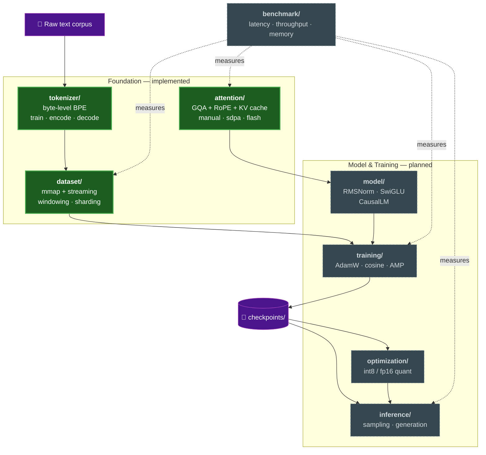
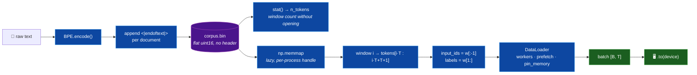
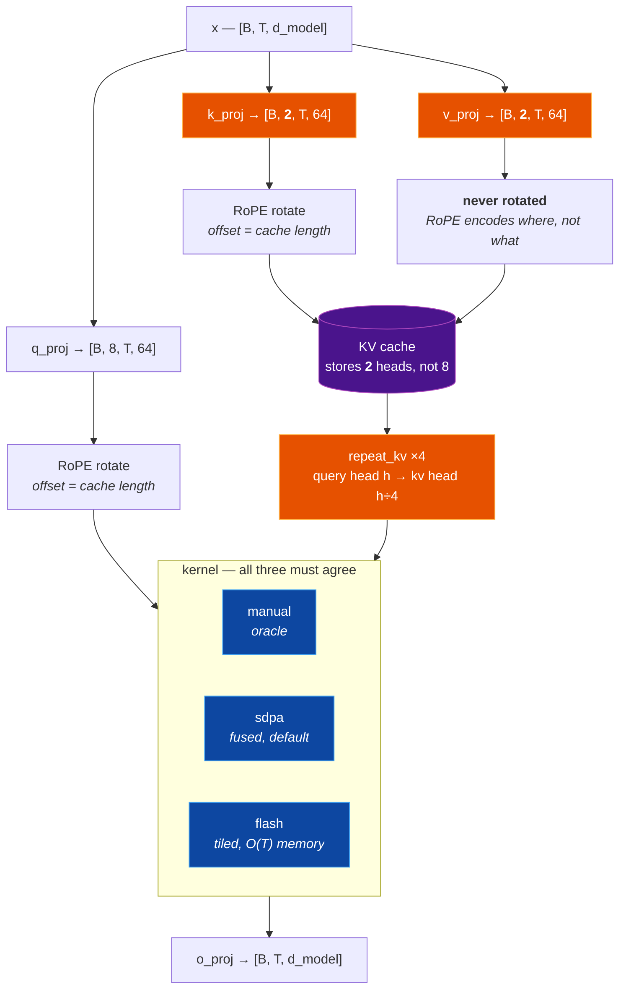
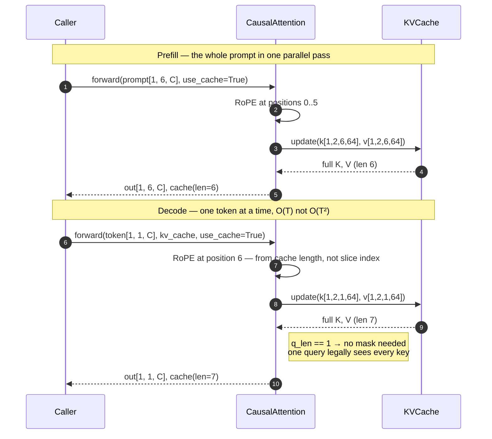
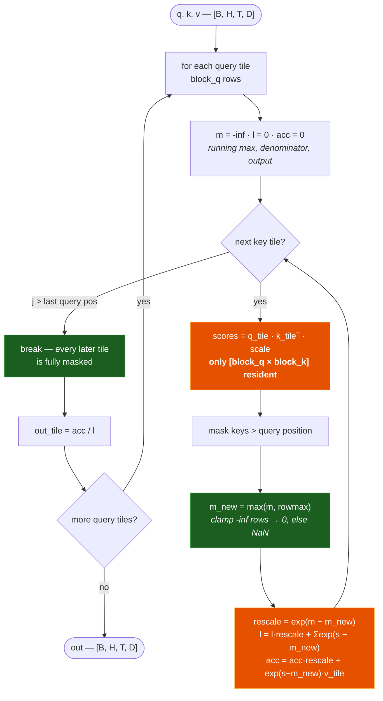
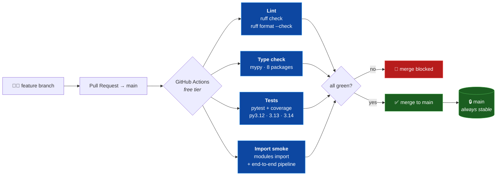
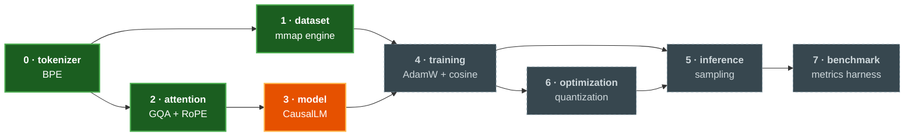

<div align='center'>
<h1 align='center'> Language Model Engine 🧠⚡ </h1>
<p align='center'> A decoder-only GPT-style language model built entirely from scratch in PyTorch — custom byte-level BPE tokenizer, memory-mapped data engine, and grouped-query causal attention with RoPE and a hand-written tiled attention kernel. No pretrained weights, no HuggingFace. </p>
<div>


</div>
</div>

---

### Project Overview

*This project builds a complete language model system from first principles, with the emphasis on low-level systems engineering rather than on training a model quickly.*

- **Everything is hand-written:** BPE merges, rotary embeddings, grouped-query attention, the KV cache, and a tiled online-softmax attention kernel are all implemented directly — the only thing borrowed from PyTorch is autograd and tensor math.
- **Three interchangeable attention kernels:** a readable `manual` reference, torch's fused `sdpa`, and our own `flash` tiled implementation. All three are asserted to produce identical output, so the reference acts as a correctness oracle for the optimised paths.
- **Memory-mapped data engine:** the corpus is a bare `uint16` array on disk read through `mmap`, so window count comes from `stat()` alone and no bulk copy ever enters RAM — even with multiprocessing workers.
- **GQA that actually saves memory:** 8 query heads share 2 KV heads, shrinking the KV cache **4×** (2048 KiB → 512 KiB per layer at 512 tokens) and the attention parameters by 37.5%.
- **Test-driven throughout:** every module's exit test is written before its implementation. **107 tests** currently pass across unit and integration suites.
- **Runs on Apple Silicon:** device resolution is `mps → cuda → cpu`, with bf16 autocast on MPS and no `GradScaler` (which is CUDA-only).

---

### System Architecture



| Module | Responsibility | State |
|---|---|---|
| `tokenizer/` | Byte-level BPE with GPT-2 style rendered-unicode keys, special tokens, JSON serialisation | ✅ 14 tests |
| `dataset/` | `uint16` corpus format, memory-mapped and streaming readers, worker sharding, `DataEngine` | ✅ 29 tests |
| `attention/` | RoPE, grouped-query causal attention, KV cache, three interchangeable kernels | ✅ 39 tests |
| `training/` | Config loading, dotted-key CLI overrides, device resolution *(loop pending)* | ◐ 20 tests |
| `model/` | Transformer blocks: RMSNorm → attention → SwiGLU → `CausalLM` head | ⬜ planned |
| `inference/` | Greedy / top-k / top-p sampling, cached autoregressive generation | ⬜ planned |
| `optimization/` | int8 / fp16 post-training quantization, memory pooling | ⬜ planned |
| `benchmark/` | Latency, throughput, memory and perplexity harness | ⬜ planned |

---

### Data Pipeline



Each window reads **`T + 1`** ids and splits them, rather than reading `T` and shifting inside the window. That one extra token means the final position gets a *real* label instead of padding — shifting inside would silently discard 1/512 of the training signal and teach one position from a fake target.

---

### Attention Architecture



#### KV cache: prefill then decode



The RoPE offset in step 7 is the single easiest bug to ship in this module: rotating a decode token at position 0 instead of `cache_len` leaves prefill looking perfect while every generated token believes it is the start of the sequence. `test_cached_decode_matches_full_forward` pins it by asserting that token-by-token decoding reproduces one full parallel forward exactly.

#### Tiled ("flash") attention



The full `T × T` score matrix is never allocated — peak memory is O(T) rather than O(T²). This is asserted rather than claimed: `test_flash_never_materialises_the_full_score_matrix` monkey-patches `torch.matmul` and fails if any intermediate exceeds the tile width.

---

### Optimization Strategy

| Concept | Implementation | Measured effect |
|---|---|---|
| **Grouped-Query Attention** | 8 query heads share 2 KV heads; the cache stores the *unexpanded* heads and `repeat_kv` expands only on read | KV cache **2048 KiB → 512 KiB** per layer at 512 tokens; attention params 1,048,576 → 655,360 |
| **KV cache** | Prefill computes all K/V once, then each decode step appends a single position | Generation drops from O(T²) recomputation to O(T) |
| **Tiled attention** | Block-wise online softmax with running max and denominator; fully-masked tiles are skipped entirely | Score memory O(T²) → O(block_q × block_k) |
| **Memory-mapped corpus** | Bare `uint16` array; `np.memmap` opened lazily *per process* and dropped on pickle | No bulk copy into RAM; each DataLoader worker gets its own handle instead of the corpus through a pipe |
| **RoPE as buffers** | cos/sin tables registered with `persistent=False` | Derived constants stay out of every checkpoint |
| **Header-free token format** | File is exactly `n_tokens × 2` bytes | Window count from `stat()` — no open, no parse, no read |

---

### Pipeline Workflow

**(1)** Tokenization:
- Text is encoded to UTF-8 bytes, so there are no unknown tokens for any input — emoji and rare scripts included.
- BPE merges are learned greedily, with deterministic tie-breaking so training is reproducible.
- Special tokens occupy the lowest ids and are atomic — never merged across.

**(2)** Corpus packing:
- Documents are encoded and joined with `<|endoftext|>` so windows cannot silently splice one document onto the next.
- Ids are validated against the `uint16` range and written as a flat array. An out-of-range id raises rather than wrapping (`65536 → 0`), which would corrupt the corpus in a way that only surfaces much later as inexplicable loss.

**(3)** Windowing:
- `stat()` gives the token count; `(n_tokens − 1) // seq_len` gives the window count.
- Each window reads `seq_len + 1` ids and splits into `input_ids` / `labels`.
- Workers shard strided (`order[worker_id::num_workers]`) so no window is emitted twice.

**(4)** Attention:
- Q/K/V are projected, split into heads, and Q/K rotated by RoPE at their absolute positions.
- KV heads are cached pre-expansion, then expanded to full head count on read.
- The kernel masks according to the `q_len` / `k_len` relationship — full triangle, no mask, or an explicit bottom-right triangle for chunked prefill.

---

### Setting up the project in your machine

#### Prerequisites

- Python 3.12+
- pip
- Git

#### Clone the repository

```bash
git clone https://github.com/555aaditya/Language-Model.git
cd Language-Model
```

#### Install dependencies

```bash
python3 -m venv .venv
source .venv/bin/activate
pip install -e ".[dev]"
```

#### Verify the install

```bash
pytest
```

*Expected output:*
```
107 passed
```

#### Run the entry point

```bash
python -m training.train --config configs/default.yaml
```

*Expected output (on Apple Silicon):*
```
device: mps | amp dtype: torch.bfloat16
dataset engine OK: input_ids (16, 512), labels (16, 512) on mps:0
```

Any config key can be overridden from the command line with dotted notation:

```bash
python -m training.train --config configs/default.yaml training.lr=3e-4 model.n_layers=12 attention.impl=flash
```

---

### Testing

```bash
pytest                                    # everything (107 tests)
pytest tests/unit -q                      # unit only
pytest tests/integration -q               # cross-module seams
pytest tests/unit/test_attention.py -q    # one module
```

Reproduce the CI gate locally:

```bash
ruff check .
ruff format --check .
mypy tokenizer dataset model attention training inference optimization benchmark
pytest --cov=tokenizer --cov=dataset --cov=attention --cov-report=term-missing
```

| Suite | Tests | What it pins |
|---|---|---|
| `test_tokenizer.py` | 14 | Encode/decode round trips, unicode, merge ordering, special tokens, serialisation |
| `test_dataset.py` | 29 | `uint16` bounds, window arithmetic, next-token shift, worker sharding, DataLoader trap avoidance |
| `test_attention.py` | 39 | Causal masking, RoPE relative-distance property, GQA group mapping, KV-cache equivalence, kernel agreement |
| `test_train_config.py` | 20 | YAML loading, dotted-key overrides, type preservation across overrides |
| `test_tokenizer_dataset_attention.py` | 5 | Cross-module seams: tokenizer → `.bin` → batches → attention |

---

### CI / Infrastructure



`main` is locked (TDR-013): all work happens on feature branches and merges only through a reviewed PR with every CI job green.

---

### Build Order



Each stage has an exit test written *before* the implementation. See [`docs/BUILD_ORDER.md`](docs/BUILD_ORDER.md) for the stable interface contracts.

---

### Tools and Technologies

| Tool / Technology | Purpose |
|---|---|
| **PyTorch 2.13** | Autograd, tensor math, and device management — every layer above that is hand-written |
| **NumPy** | `memmap` corpus reader and the `uint16` on-disk token format |
| **Apple MPS** | Primary development accelerator; bf16 autocast, fused `scaled_dot_product_attention` |
| **pytest** | 107-test TDD suite — exit tests written before each module |
| **ruff** | Linting and formatting, 100-char lines, `E/F/I/W/UP/B` rule set |
| **mypy** | Static type checking across all eight packages |
| **PyYAML** | Config format, reused as the CLI override parser so types can never diverge |
| **GitHub Actions** | Free-tier CI: lint, type check, tests on three Pythons, import smoke |

---

### Key Design Decisions

Full rationale and alternatives for each is recorded as a Technical Decision Record in [`docs/TDD.md` §13](docs/TDD.md).

| Decision | Rationale |
|---|---|
| **Byte-level BPE** (TDR-002) | Zero out-of-vocabulary tokens for arbitrary UTF-8. A GPT-2 style `bytes_to_unicode` table renders every byte to a printable character, so token keys never collide with special-token text. |
| **Rotary position embeddings** (TDR-015) | Attention scores become a function of *relative* offset, removing a `max_seq_len × d_model` parameter table entirely. Supersedes the learnable absolute table originally specified in TDR-006, which was never implemented. |
| **Grouped-query attention** (TDR-016) | The KV cache — not the weights — dominates decode memory, and it scales with `n_kv_heads`. A 4:1 group ratio cuts the cache 4× for negligible quality cost, which matters directly on unified memory. |
| **RMSNorm + SwiGLU** (TDR-017) | RMSNorm drops mean-centring and bias for one fewer reduction pass; SwiGLU's multiplicative gate beats a plain GELU MLP at equal parameter count. |
| **Loss lives in the trainer, not the model** | `CausalLM.forward` returns logits only. Computing a loss during inference is wasted work, and keeping the model pure makes the generation path obvious. |
| **Dict batches, not tuples** | Datasets yield `{"input_ids", "labels"}` so a field can be added later without breaking every caller — and so a transposed `(x, y)` can't silently typecheck. |
| **`uint16` token format** | Caps the vocabulary at 65,536, comfortably above GPT-2's 50,257. Out-of-range ids raise instead of widening the format and doubling the page-cache footprint. |
| **Three attention kernels, asserted equal** (TDR-007) | Optimised kernels are only trustworthy against a reference. `manual` is the oracle; `sdpa` and `flash` must match it within floating-point tolerance or the build fails. |
| **Python 3.12 floor** | numpy ≥ 2.3 ships PEP 695 syntax in its stubs that mypy rejects when targeting older versions. Rather than typecheck against a Python we never run, runtime, ruff, mypy and the CI matrix all share one floor. |
| **MPS as the primary target** (TDR-019) | It is the hardware this is actually built on, so it is the only device whose numbers can be reported honestly. Benchmarks are always reported per-device, never as a general claim. |
| **Locked `main`, PR-gated** (TDR-013) | Every state of the repository stays auditable and revertible; CI green is a merge requirement. |

---

### Repository Layout

```
Language-Model/
├── tokenizer/        # byte-level BPE          ✅
│   └── bpe.py
├── dataset/          # data engine             ✅
│   ├── binfile.py        # uint16 corpus format
│   ├── token_dataset.py  # mmap / streaming / synthetic readers
│   └── engine.py         # DataEngine → endless device-ready batches
├── attention/        # attention               ✅
│   ├── rope.py           # rotary position embeddings
│   ├── kv_cache.py       # per-layer K/V cache
│   ├── kernels.py        # manual · sdpa · flash
│   └── causal.py         # CausalAttention (GQA)
├── training/         # entry point + device    ◐
│   ├── train.py          # config, overrides, CLI
│   └── device.py         # mps → cuda → cpu resolution
├── model/            # transformer blocks      ⬜
├── inference/        # sampling / generation   ⬜
├── optimization/     # quantization            ⬜
├── benchmark/        # metrics harness         ⬜
├── configs/          # default.yaml
├── checkpoints/      # serialised state
├── docs/             # TDD.md · BUILD_ORDER.md
├── tests/            # unit/ + integration/
└── .github/          # CI workflows
```

---

### Documentation

| Document | Contents |
|---|---|
| [`docs/TDD.md`](docs/TDD.md) | Full technical design — architecture, algorithms, memory analysis, tradeoff matrices, and 19 Technical Decision Records |
| [`docs/BUILD_ORDER.md`](docs/BUILD_ORDER.md) | Dependency-aware sequencing and the stable interface contracts between modules |
| `~/.claude/vault/language-model/` | Long-lived engineering notes and gotchas, kept outside the repo (TDR-018) |
